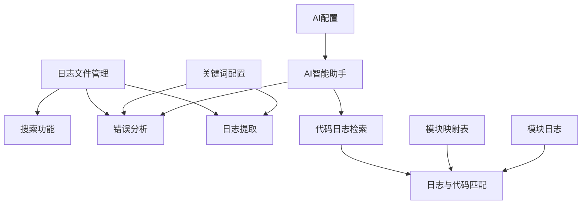
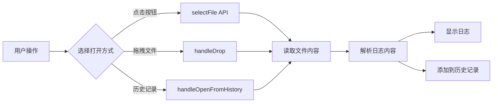
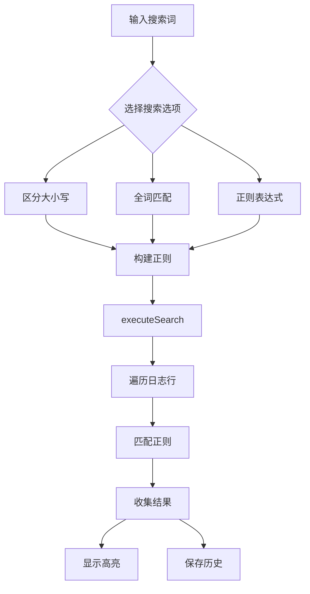
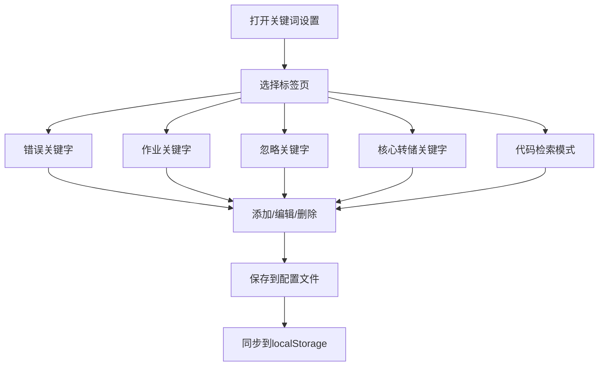
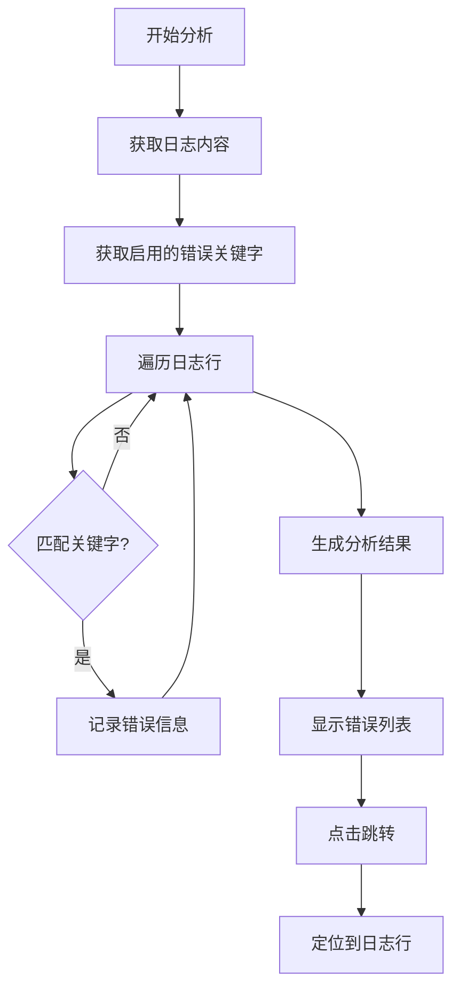
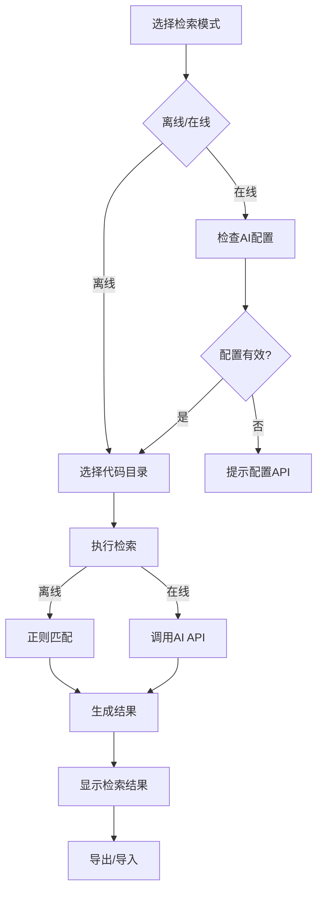
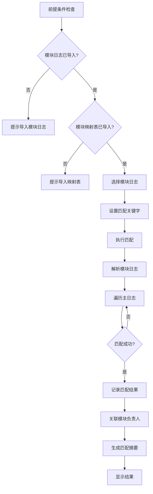
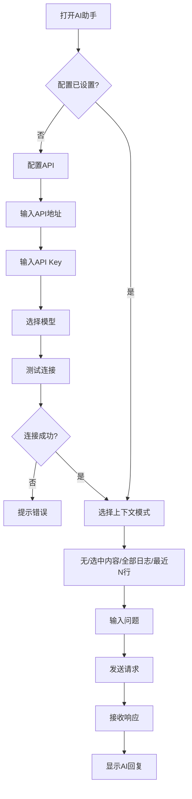
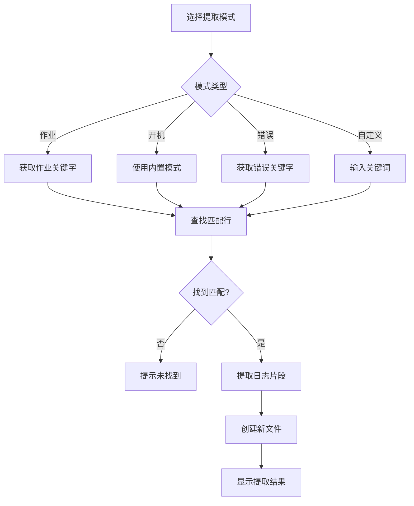
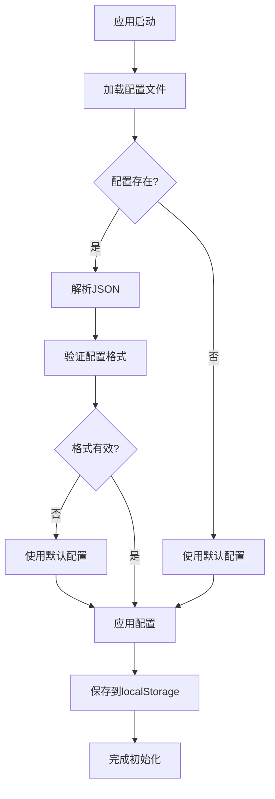

# Log Analyzer 工具使用说明（完整版）

---

## 目录

1. [概述](#概述)
2. [项目架构与依赖关系](#项目架构与依赖关系)
3. [功能模块详解](#功能模块详解)
   - [3.1 日志文件管理](#31-日志文件管理)
   - [3.2 搜索功能](#32-搜索功能)
   - [3.3 关键词配置管理](#33-关键词配置管理)
   - [3.4 错误分析](#34-错误分析)
   - [3.5 代码日志检索](#35-代码日志检索)
   - [3.6 日志与代码匹配](#36-日志与代码匹配)
   - [3.7 AI智能助手](#37-ai智能助手)
   - [3.8 日志提取](#38-日志提取)
4. [数据结构定义](#数据结构定义)
5. [配置文件说明](#配置文件说明)
6. [测试数据说明](#测试数据说明)
7. [角色权限对比](#角色权限对比)
8. [常见问题](#常见问题)

---

## 1. 概述

Log Analyzer 是一款跨平台日志分析桌面应用程序，基于 **Electron + React + TypeScript** 构建。该工具提供强大的日志查看、搜索、分析和代码关联功能，适用于测试人员和开发人员进行日志排查和问题定位。

### 核心价值

```
┌─────────────────────────────────────────────────────────────────┐
│                    Log Analyzer 核心价值                         │
├─────────────────────────────────────────────────────────────────┤
│  🔍 快速定位：通过关键词匹配快速定位日志中的错误                  │
│  🔗 代码关联：将日志与源代码中的日志打印点进行关联               │
│  🤖 AI辅助：利用AI能力分析日志，获取专业建议                     │
│  📊 智能分析：自动检测错误、过滤日志、提取关键片段               │
│  👥 角色区分：针对测试和研发提供不同功能视图                     │
└─────────────────────────────────────────────────────────────────┘
```

---

## 2. 项目架构与依赖关系

### 2.1 项目目录结构

```
Log-Analyzer/
├── src/                      # React 渲染进程代码
│   ├── components/           # React 组件（核心功能模块）
│   │   ├── Toolbar.tsx       # 工具栏组件
│   │   ├── LogViewer.tsx     # 日志查看器
│   │   ├── SearchDialog.tsx  # 搜索对话框
│   │   ├── AnalysisPanel.tsx # 分析面板（错误分析、Coredump）
│   │   ├── LogMatchPanel.tsx # 日志匹配面板
│   │   ├── CodeSearchPanel.tsx # 代码日志检索面板
│   │   ├── KeywordSettingsDialog.tsx # 关键词设置
│   │   ├── AIDialog.tsx      # AI助手对话框
│   │   └── ...
│   ├── utils/                # 工具函数
│   │   ├── db.ts             # 数据库操作
│   │   └── logger.ts         # 日志记录
│   ├── types.ts              # TypeScript 类型定义
│   └── App.tsx               # 主应用组件
├── electron/                 # Electron 主进程代码
│   ├── main.ts               # 主进程入口
│   └── preload.ts            # 预加载脚本
├── test_data/                # 测试数据（依赖文件）
│   ├── test_log.txt          # 测试日志文件
│   ├── a.json                # 代码检索结果示例
│   ├── module_mapping.json   # 模块映射表
│   └── 网络模块_李四.json     # 模块日志示例
├── log-analyzer-config.json  # 应用配置文件
└── package.json              # 项目依赖配置
```

### 2.2 功能依赖关系图



### 2.3 依赖文件关系表

| 功能模块 | 依赖文件 | 依赖类型 | 文件位置 |
|---------|---------|---------|---------|
| 日志匹配 | `module_mapping.json` | 模块-负责人映射 | `test_data/` |
| 日志匹配 | `网络模块_李四.json` | 模块日志配置 | `test_data/` |
| 代码检索 | `a.json` | 检索结果示例 | `test_data/` |
| 错误分析 | `log-analyzer-config.json` | 错误关键字配置 | 项目根目录 |
| AI助手 | `log-analyzer-config.json` | AI配置信息 | 项目根目录 |

---

## 3. 功能模块详解

### 3.1 日志文件管理

#### 3.1.1 功能概述

负责日志文件的打开、管理和历史记录维护。

#### 3.1.2 功能流程



#### 3.1.3 核心代码

**文件打开处理** (`src/App.tsx#L319-L344`)：

```typescript
const handleOpenFile = async () => {
  const result = await window.electronAPI.selectFile()
  if (result) {
    setLogFiles([result])
    setCurrentFileIndex(0)
    addToHistory(result.filePath)
  }
}
```

#### 3.1.4 支持的文件格式

| 格式 | 扩展名 | 说明 |
|------|-------|------|
| 日志文件 | `.log`, `.txt`, `.out`, `.err` | 纯文本日志 |
| 压缩日志 | `.log.1`, `.log.2` | 轮转日志文件 |

---

### 3.2 搜索功能

#### 3.2.1 功能概述

支持正则表达式搜索、多关键词高亮、搜索历史管理等功能。

#### 3.2.2 功能流程



#### 3.2.3 搜索选项说明

| 选项 | 作用 | 正则影响 |
|------|------|---------|
| 区分大小写 | 搜索时区分大小写 | `g` vs `gi` |
| 全词匹配 | 只匹配完整单词 | 添加 `\b` 边界 |
| 正则表达式 | 使用正则语法 | 直接使用输入 |

#### 3.2.4 快捷键

| 快捷键 | 功能 |
|--------|------|
| `Ctrl+F` | 打开搜索对话框 |
| `Enter` | 下一个结果 |
| `Shift+Enter` | 上一个结果 |
| `F3` | 下一个结果 |

---

### 3.3 关键词配置管理

#### 3.3.1 功能概述

管理各类关键字配置，包括错误关键字、作业关键字、忽略关键字、核心转储关键字等。

#### 3.3.2 关键字类型说明

| 类型 | 用途 | 配置位置 |
|------|------|---------|
| **错误关键字** | 错误分析时匹配日志中的错误 | `log-analyzer-config.json` |
| **作业关键字** | 日志提取时识别作业开始标记 | `log-analyzer-config.json` |
| **忽略关键字** | 过滤日志时排除匹配行 | `log-analyzer-config.json` |
| **核心转储关键字** | Coredump分析时匹配 | `log-analyzer-config.json` |
| **代码检索模式** | 离线代码检索的正则表达式 | localStorage |

#### 3.3.3 配置管理流程



#### 3.3.4 配置文件结构

```json
{
  "errorKeywords": [
    {
      "keyword": "print_err",
      "description": "打印模块错误",
      "enabled": true
    }
  ],
  "jobKeywords": [...],
  "ignoreKeywords": [...],
  "coreDumpKeywords": [...],
  "highlightConfig": {
    "backgroundColor": "#ffeb3b",
    "textColor": "#000000",
    "borderColor": "#f9a825"
  }
}
```

---

### 3.4 错误分析

#### 3.4.1 功能概述

根据配置的错误关键字自动分析日志，定位错误位置并提供处理建议。

#### 3.4.2 分析流程



#### 3.4.3 核心代码

**错误分析逻辑** (`src/components/AnalysisPanel.tsx#L142-L167`)：

```typescript
const handleAnalyzeErrors = () => {
  const errors: DetectedError[] = []
  const lines = content.split('\n')
  
  lines.forEach((line, lineIndex) => {
    errorKeywords.forEach(({ keyword, description, enabled }) => {
      if (enabled && line.toLowerCase().includes(keyword.toLowerCase())) {
        errors.push({ keyword, description, line: lineIndex + 1, context: line.trim() })
      }
    })
  })
  
  setErrorResults(errors.slice(0, 200))
}
```

#### 3.4.4 默认错误关键字

| 关键字 | 描述 | 处理建议 |
|--------|------|---------|
| `print_err` | 打印模块错误 | 联系打印团队 |
| `copy_err` | 复制模块错误 | 联系文件传输团队 |
| `scan_err` | 扫描模块错误 | 联系扫描团队 |
| `error` | 通用错误 | 检查日志上下文 |
| `exception` | 异常抛出 | 联系开发团队 |
| `fatal` | 致命错误 | 立即联系运维团队 |

---

### 3.5 代码日志检索

#### 3.5.1 功能概述

在源代码中检索日志打印语句，支持离线和在线两种模式。

#### 3.5.2 检索流程



#### 3.5.3 支持的日志模式

| 模式名称 | 正则表达式 | 说明 |
|---------|-----------|------|
| LOGE错误 | `LOGE\s*\(\s*"[^"]*"` | C/C++ LOGE打印 |
| VIDEO_LOGE错误 | `VIDEO_LOGE\s*\(\s*"[^"]*"` | C/C++ VIDEO_LOGE打印 |

#### 3.5.4 数据结构

**代码检索结果** (`src/types.ts#L98-L104`)：

```typescript
export interface CodeSearchResult {
  codeFile: CodeFile           // 代码文件信息
  line: number                 // 行号
  functionName: string         // 函数名
  matchedPattern: string       // 匹配的模式名称
  matchedText: string          // 匹配的静态文本
}
```

---

### 3.6 日志与代码匹配

#### 3.6.1 功能概述

将错误日志与模块日志（代码检索结果）进行关联分析，显示匹配的代码和对应的日志行号。

#### 3.6.2 匹配流程图



#### 3.6.3 依赖文件说明

**核心依赖文件结构**：

| 文件类型 | 格式 | 必需字段 | 示例文件 |
|---------|------|---------|---------|
| 模块日志 | JSON | `codeSearchResults` | `test_data/网络模块_李四.json` |
| 模块映射表 | JSON | `mappings` | `test_data/module_mapping.json` |

**模块日志格式** (`test_data/网络模块_李四.json`)：

```json
{
  "codeSearchResults": [
    {
      "codeFile": { "fileName": "C:\\project\\2\\network.c" },
      "line": 88,
      "functionName": "sendData",
      "matchedPattern": "LOGE错误",
      "matchedText": "Network send error"
    }
  ],
  "exportedAt": "2024-05-22T10:00:00.000Z"
}
```

**模块映射表格式** (`test_data/module_mapping.json`)：

```json
{
  "version": "1.0",
  "mappings": [
    {
      "codePath": "project\\1",
      "moduleName": "打印模块",
      "contactName": "张三"
    }
  ]
}
```

#### 3.6.4 匹配规则

```
日志格式要求：L{行号}: {日志内容}
例如：L42: Video decode failed

匹配逻辑：
1. 从模块日志中提取静态文本（matchedText）
2. 在主日志中查找格式为 "L{行号}" 的行
3. 检查行号和静态文本是否匹配
4. 通过模块映射表关联负责人信息
```

#### 3.6.5 核心代码

**匹配逻辑** (`src/components/LogMatchPanel.tsx#L47-L176`)：

```typescript
const handleMatch = () => {
  // 1. 检查前提条件
  if (selectedModuleIds.length === 0) return
  if (moduleMappings.length === 0) {
    onShowNotification('请先导入模块映射表')
    return
  }
  
  // 2. 解析模块日志
  selectedModules.forEach(moduleLog => {
    const parsed = JSON.parse(moduleLog.content)
    const codeSearchResults = parsed.codeSearchResults || parsed
    // ... 提取匹配模式
    
    // 3. 在主日志中查找匹配
    mainLogLines.forEach((mainLine, mainIndex) => {
      const mainMatch = mainLine.match(/L(\d+)[:：]?\s*(.*)/)
      if (mainMatch) {
        // 匹配行号和文本
      }
    })
  })
  
  // 4. 关联模块负责人
  matchedCodePaths.forEach(codePath => {
    const mapping = moduleMappings.find(m => isPathSegmentMatch(codePath, m.codePath))
    // ...
  })
}
```

#### 3.6.6 使用步骤

| 步骤 | 操作 | 说明 |
|------|------|------|
| 1 | 导入模块日志 | 点击「导入配置」→「导入模块日志」 |
| 2 | 导入模块映射表 | 点击「导入配置」→「导入模块映射表」 |
| 3 | 打开快速分析 | 点击「🔗 快速分析」按钮 |
| 4 | 选择模块 | 在面板中勾选要匹配的模块 |
| 5 | 执行匹配 | 点击「🔍 开始匹配」按钮 |
| 6 | 查看结果 | 查看匹配结果和负责人信息 |

---

### 3.7 AI智能助手

#### 3.7.1 功能概述

调用AI API分析日志，获取专业的分析建议和问题诊断。

#### 3.7.2 使用流程



#### 3.7.3 AI配置说明

| 配置项 | 说明 | 示例 |
|--------|------|------|
| API地址 | AI服务端点 | `https://api.openai.com/v1` |
| API Key | 认证密钥 | `sk-xxx...` |
| 模型名称 | 模型标识 | `gpt-3.5-turbo` |
| 上下文行数 | 参考行数 | `100` |

#### 3.7.4 上下文模式对比

| 模式 | 说明 | 适用场景 |
|------|------|---------|
| 无 | 不提供日志上下文 | 一般性问题 |
| 选中内容 | 仅使用选中内容 | 特定片段分析 |
| 全部日志 | 使用整个日志 | 全面分析 |
| 最近N行 | 使用最近N行 | 最新问题分析 |

---

### 3.8 日志提取

#### 3.8.1 功能概述

提取特定部分的日志，支持多种提取模式。

#### 3.8.2 提取模式说明

| 模式 | 功能 | 关键字来源 |
|------|------|-----------|
| 倒数第N个作业 | 提取最近的作业日志 | 作业关键字配置 |
| 最后开机/重启 | 提取系统启动后的日志 | 内置模式匹配 |
| 最后错误 | 提取最后错误的上下文 | 错误关键字配置 |
| 自定义关键词 | 按关键字提取 | 用户输入 |

#### 3.8.3 提取流程



---

## 4. 数据结构定义

### 4.1 核心类型关系

```mermaid
classDiagram
    class LogFile {
        +filePath: string
        +content: string
        +fileName: string
        +lineOffsets?: number[]
    }
    
    class ErrorKeyword {
        +keyword: string
        +description: string
        +enabled: boolean
    }
    
    class CodeSearchResult {
        +codeFile: CodeFile
        +line: number
        +functionName: string
        +matchedPattern: string
        +matchedText: string
    }
    
    class ModuleLog {
        +id: string
        +name: string
        +filePath: string
        +content: string
        +lineCount: number
        +importedAt: number
    }
    
    class ModuleMapping {
        +codePath: string
        +moduleName: string
        +contactName: string
    }
    
    class MatchResult {
        +codeResult: CodeSearchResult
        +moduleLog: ModuleLog
        +matchedLines: Array~{lineNumber: number, lineText: string}~
    }
    
    LogFile "1" --> "*" MatchResult : 匹配
    ModuleLog "1" --> "*" MatchResult : 包含
    CodeSearchResult "1" --> "1" MatchResult : 关联
    ModuleMapping "1" --> "*" MatchResult : 映射
```

### 4.2 类型定义索引

| 类型名称 | 定义位置 | 用途 |
|---------|---------|------|
| `LogFile` | `src/types.ts#L1-L6` | 日志文件数据 |
| `ErrorKeyword` | `src/types.ts#L8-L12` | 错误关键字 |
| `JobKeyword` | `src/types.ts#L14-L18` | 作业关键字 |
| `IgnoreKeyword` | `src/types.ts#L20-L24` | 忽略关键字 |
| `CoreDumpKeyword` | `src/types.ts#L32-L36` | 核心转储关键字 |
| `CodeSearchResult` | `src/types.ts#L98-L104` | 代码检索结果 |
| `ModuleLog` | `src/types.ts#L116-L123` | 模块日志 |
| `ModuleMapping` | `src/types.ts#L162-L166` | 模块映射 |
| `MatchResult` | `src/types.ts#L125-L132` | 匹配结果 |
| `AIConfig` | `src/types.ts#L190-L196` | AI配置 |

---

## 5. 配置文件说明

### 5.1 主配置文件

**文件位置**：`log-analyzer-config.json`

**配置结构**：

| 字段 | 类型 | 说明 |
|------|------|------|
| `errorKeywords` | `ErrorKeyword[]` | 错误关键字列表 |
| `jobKeywords` | `JobKeyword[]` | 作业关键字列表 |
| `ignoreKeywords` | `IgnoreKeyword[]` | 忽略关键字列表 |
| `coreDumpKeywords` | `CoreDumpKeyword[]` | 核心转储关键字列表 |
| `highlightConfig` | `HighlightConfig` | 高亮样式配置 |
| `searchTags` | `SearchTag[]` | 搜索标签列表 |
| `aiConfig` | `AIConfig` | AI配置 |

### 5.2 配置加载流程



---

## 6. 测试数据说明

### 6.1 测试数据文件

| 文件 | 类型 | 用途 |
|------|------|------|
| `test_log.txt` | 日志文件 | 测试日志分析功能 |
| `a.json` | 代码检索结果 | 测试代码检索导入 |
| `module_mapping.json` | 模块映射表 | 测试日志匹配功能 |
| `网络模块_李四.json` | 模块日志 | 测试日志匹配功能 |

### 6.2 测试数据使用

**步骤1：打开测试日志**
```
点击「📄 打开Log」→ 选择 test_data/test_log.txt
```

**步骤2：导入模块日志**
```
点击「📥 导入配置」→「导入模块日志」→ 选择 test_data/网络模块_李四.json
```

**步骤3：导入模块映射表**
```
点击「📥 导入配置」→「导入模块映射表」→ 选择 test_data/module_mapping.json
```

**步骤4：执行匹配**
```
点击「🔗 快速分析」→ 勾选模块 → 点击「🔍 开始匹配」
```

---

## 7. 角色权限对比

### 7.1 功能权限矩阵

| 功能 | 测试角色 | 研发角色 | 说明 |
|------|---------|---------|------|
| 打开日志 | ✅ | ✅ | 基础功能 |
| 搜索功能 | ✅ | ✅ | 基础功能 |
| 历史记录 | ✅ | ✅ | 基础功能 |
| 导入配置 | ✅ | ✅ | 基础功能 |
| 快速分析 | ✅ | ✅ | 核心功能 |
| 关键词设置 | ❌ | ✅ | 高级配置 |
| 分析工具 | ❌ | ✅ | 错误/Coredump分析 |
| 代码日志检索 | ❌ | ✅ | 代码关联 |
| AI助手 | ❌ | ✅ | AI分析 |
| 数据管理面板 | ❌ | ✅ | 同步管理 |

### 7.2 角色选择界面

```
┌─────────────────────────────────────────────┐
│          请选择您的角色                      │
├─────────────────────────────────────────────┤
│                                             │
│   👨‍💻 研发工程师      👨‍🔧 测试工程师         │
│                                             │
│   完整功能集         简化功能视图            │
│   • 代码日志检索      • 日志查看             │
│   • AI智能助手       • 快速分析             │
│   • 关键词管理       • 搜索功能             │
                                             │
└─────────────────────────────────────────────┘
```

### 7.3 测试角色使用指南

#### 7.3.1 典型工作流程

```
┌─────────────────────────────────────────────────────────────┐
│                  测试角色工作流程                            │
├─────────────────────────────────────────────────────────────┤
│  1. 打开日志文件                                            │
│     ↓                                                      │
│  2. 快速分析（定位错误）                                    │
│     ↓                                                      │
│  3. 使用搜索功能精确定位                                    │
│     ↓                                                      │
│  4. 日志提取（提取关键片段）                                 │
│     ↓                                                      │
│  5. 生成问题报告                                            │
└─────────────────────────────────────────────────────────────┘
```

#### 7.3.2 常用功能说明

| 功能 | 操作入口 | 使用场景 |
|------|---------|---------|
| 打开日志 | 工具栏 → 📂 打开Log | 加载待分析的日志文件 |
| 快速分析 | 工具栏 → ⚡ 快速分析 | 一键定位错误关键字 |
| 搜索功能 | 工具栏 → 🔍 查找 / Ctrl+F | 搜索特定内容 |
| 历史记录 | 工具栏 → 📜 历史记录 | 快速打开最近文件 |
| 导入配置 | 工具栏 → 📥 导入配置 | 导入模块映射表 |
| 日志提取 | 右键菜单 → 提取日志 | 提取作业/开机/错误日志 |

#### 7.3.3 问题定位技巧

1. **快速定位错误**：使用「快速分析」按钮，自动检测日志中的错误关键字
2. **精确搜索**：使用搜索功能的正则表达式模式进行复杂匹配
3. **日志提取**：提取最后N个作业日志或错误日志进行专项分析
4. **模块关联**：通过导入的模块映射表，快速定位问题归属模块

---

### 7.4 研发角色使用指南

#### 7.4.1 典型工作流程

```
┌─────────────────────────────────────────────────────────────┐
│                  研发角色工作流程                            │
├─────────────────────────────────────────────────────────────┤
│  1. 打开日志文件                                            │
│     ↓                                                      │
│  2. 代码日志检索（定位日志打印点）                           │
│     ↓                                                      │
│  3. 日志与代码匹配（关联分析）                              │
│     ↓                                                      │
│  4. 分析工具（错误/Coredump分析）                           │
│     ↓                                                      │
│  5. AI助手（智能分析）                                      │
│     ↓                                                      │
│  6. 定位问题代码行                                          │
└─────────────────────────────────────────────────────────────┘
```

#### 7.4.2 常用功能说明

| 功能 | 操作入口 | 使用场景 |
|------|---------|---------|
| 代码日志检索 | 工具栏 → 🔎 代码日志检索 | 在源码中查找日志打印语句 |
| 日志匹配 | 工具栏 → ⚡ 快速分析 | 将错误日志与代码模块关联 |
| 分析工具 | 工具栏 → 🧪 分析 | 错误分析、Coredump分析 |
| AI助手 | 工具栏 → 🤖 AI助手 | AI辅助日志分析 |
| 关键词设置 | 工具栏 → ⚙️ 关键词设置 | 配置错误关键字规则 |
| 数据管理 | 工具栏 → 📊 数据管理 | 管理模块日志和映射表 |

#### 7.4.3 代码定位技巧

1. **代码日志检索**：使用离线模式快速查找源码中的日志打印点，或使用在线模式进行AI智能分析
2. **日志与代码匹配**：将错误日志与模块日志进行关联，定位问题代码行
3. **Coredump分析**：遇到崩溃问题时，使用分析工具查看GDB常用指令
4. **AI辅助**：使用AI助手对复杂日志进行智能分析，获取专业建议

---

## 8. 常见问题

### Q1：日志匹配功能需要哪些前提条件？

**A**：需要满足以下条件：

| 前提条件 | 说明 | 操作路径 |
|---------|------|---------|
| 模块日志已导入 | 包含代码检索结果的JSON文件 | 导入配置 → 导入模块日志 |
| 模块映射表已导入 | 代码路径与负责人的映射 | 导入配置 → 导入模块映射表 |
| 日志格式正确 | 日志行格式为 `L{行号}: {内容}` | 确保日志格式符合要求 |

### Q2：如何配置AI助手？

**A**：
1. 点击「🤖 AI助手」按钮
2. 点击设置图标 ⚙️
3. 输入API地址和API Key
4. 选择模型名称
5. 点击「测试连接」验证配置

### Q3：代码检索离线模式和在线模式有什么区别？

**A**：

| 模式 | 原理 | 优点 | 缺点 |
|------|------|------|------|
| 离线 | 正则表达式匹配 | 无需网络，速度快 | 模式固定，不够灵活 |
| 在线 | AI分析源码 | 智能分析，支持复杂模式 | 需要网络和API配置 |

### Q4：如何导出代码检索结果？

**A**：
1. 执行代码检索
2. 在代码检索面板点击「📤 导出」按钮
3. 选择保存位置
4. 结果将保存为JSON文件

### Q5：如何重置角色选择？

**A**：
1. 点击「⚙️ 软件设置」按钮
2. 点击「重置角色」按钮
3. 应用将重启并显示角色选择界面

---

## 附录：快捷键汇总

| 快捷键 | 功能 |
|--------|------|
| `Ctrl + F` | 打开搜索对话框 |
| `Ctrl + G` | 跳转到指定行 |
| `Ctrl + Z` | 撤销操作 |
| `Ctrl + C` | 复制选中内容 |
| `Enter` | 下一个搜索结果 |
| `Shift + Enter` | 上一个搜索结果 |
| `F3` | 下一个搜索结果 |

---

**版本**: v1.0.0  
**最后更新**: 2024年  
**文档位置**: `Log-Analyzer/工具使用说明.md`